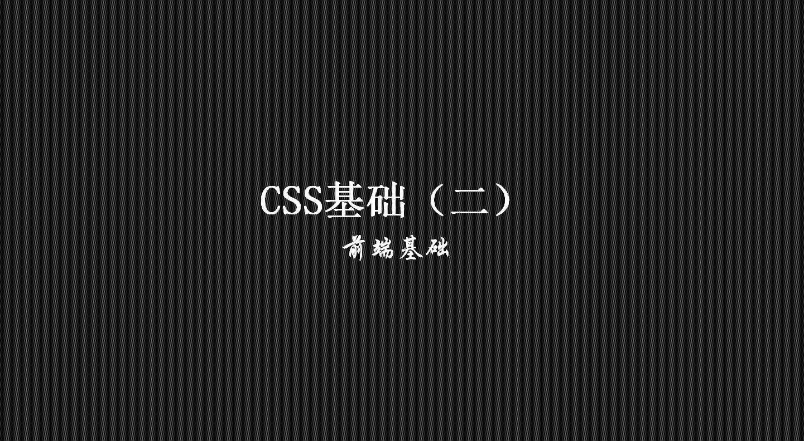
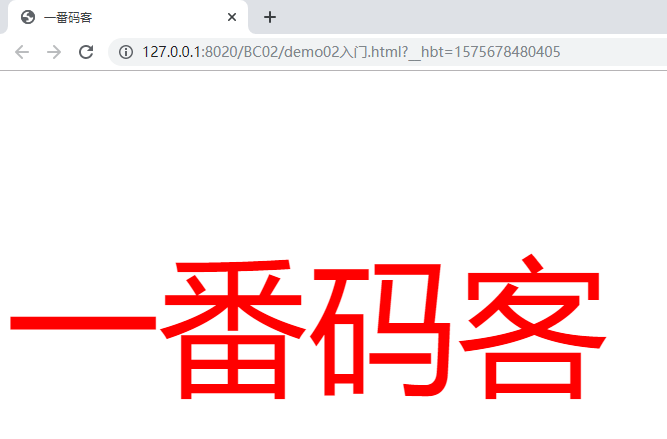

> **一番码客：挖掘你关心的亮点。**
> **http://efonfighting.imwork.net**

本文目录：

[TOC]



<!--more-->

## 使用方法

### 行内样式/内联样式


```html
<!DOCTYPE html>
<html>
	<head>
		<meta charset="UTF-8">
		<title></title>
	</head>
	<body>
		<!--
			行内样式
		-->
		<p style="color: red;font-size: 50px;">一番码客</p>
	</body>
</html>

```

* 规则：在开始标签中声明style属性，之后声明样式。多个样式用分号分隔。
* 格式：`style="属性名:属性值;属性名:属性值;"`。
* 缺点：增加标签的内容，不便于后期维护，因此不建议使用。

### 内部样式



```html
<!DOCTYPE html>
<html>
	<head>
		<meta charset="UTF-8">
		<title>一番码客</title>
		<!--	
			内部样式
		-->
		<style type="text/css">
			p{
				color: red;
				font-size: 150px;
			}
		</style>
	</head>
	
	<body>
		<p>一番码客</p>
	</body>
</html>
```

* 格式：在`head`标签中声明`style`标签。
* 选择器{属性名:属性值;属性名:属性值;}。
* 在开发时使用，在产品上线的时候不使用。

### 外部样式表

```html
<!DOCTYPE html>
<html>
	<head>
		<meta charset="UTF-8">
		<title>一番码客</title>
		<!--	
			外部样式
		-->
		<link rel="stylesheet" type="text/css" href="css/demo05.css"/>
	</head>
	
	<body>
		<p>一番码客</p>
	</body>
</html>
```

```css
/* css/demo05.css */
p{
	color: red;
	font-size: 150px;
}
```

* 规则：
    * 将样式定义在一个外部文件中，后缀为`.css`。样式文件的写法和内部样式是一样的，但是不要`style`标签。
    * 在页面中使用`<link href="style.css" type="text/css" rel="stylesheet"/>`标签引用。

* `href`属性指定css文件的位置，可以使用相对路径或绝对路径。

### 导入式

```html
<!DOCTYPE html>
<html>
	<head>
		<meta charset="UTF-8">
		<title>一番码客</title>
		<!--	
			导入式样式
		-->
		<style type="text/css">
			@import url("css/demo05.css");
		</style>
	</head>
	
	<body>
		<p>一番码客</p>
	</body>
</html>

```

* 规则：
    * 将样式定义在一个外部文件中，后缀为`.css`。
    * 在`head`标签中声明style标签，使用`@import url(style.css);`引入样式。
* 在url标签中声明样式文件的路径。
* 先加载结构，再加载样式，不推荐使用。

## 对比

| 类别       | 引入方法              | 位置          | 加载顺序                          |
| ---------- | --------------------- | ------------- | --------------------------------- |
| 行内样式   | 开始标签              | html中        | 和HTML页面同时加载                |
| 内部样式   | head标签中style标签中 | html中        | 和HTML页面同时加载                |
| 外部样式   | head标签中link标签中  | 外部CSS文件中 | HTML页面加载时同时加载外部css文件 |
| 导入时样式 | head标签中style标签中 | 外部CSS文件中 | HTML页面加载完成后加载外部css文件 |


## 优先级


```html
<!DOCTYPE html>
<html>
	<head>
		<meta charset="UTF-8">
		<title>一番码客</title>
		<style type="text/css">
			@import url("css/demo05.css");
			p{
				color: blue;
				font-size: 150px;
			}
		</style>
		<link rel="stylesheet" type="text/css" href="css/demo05.css"/>
	</head>
	
	<body>
		<p style="color: green;font-size: 50px;">一番码客</p>
	</body>
</html>
```

* 就近原则，哪个声明离内容最近，那个规则生效

## 总结

* 实际开发中较多使用外部样式表。
    * css和html进行了分离。
    * 多个页面可以共同共用一个css文件。
    * 多个页面共用同一个css文件时，只需要下载一次。

## 参考

* 黑马程序员 120天全栈区块链开发 开源教程

  > https://github.com/itheima1/BlockChain
  

----

> **一番雾语：CSS文件的四种使用方式。**

----------

> **免费知识星球： [一番码客-积累交流](http://efonfighting.imwork.net/efonmark-blog/%E7%AE%80%E4%BB%8B/zhishixingqiu1.png)**
> **微信公众号：[一番码客](http://efonfighting.imwork.net/efonmark-blog/%E7%AE%80%E4%BB%8B/guanzhu_1.jpg)**
> **微信：[Efon-fighting](http://efonfighting.imwork.net/efonmark-blog/%E7%AE%80%E4%BB%8B/weixin.jpg)**
> **网站： [http://efonfighting.imwork.net](http://efonfighting.imwork.net)**