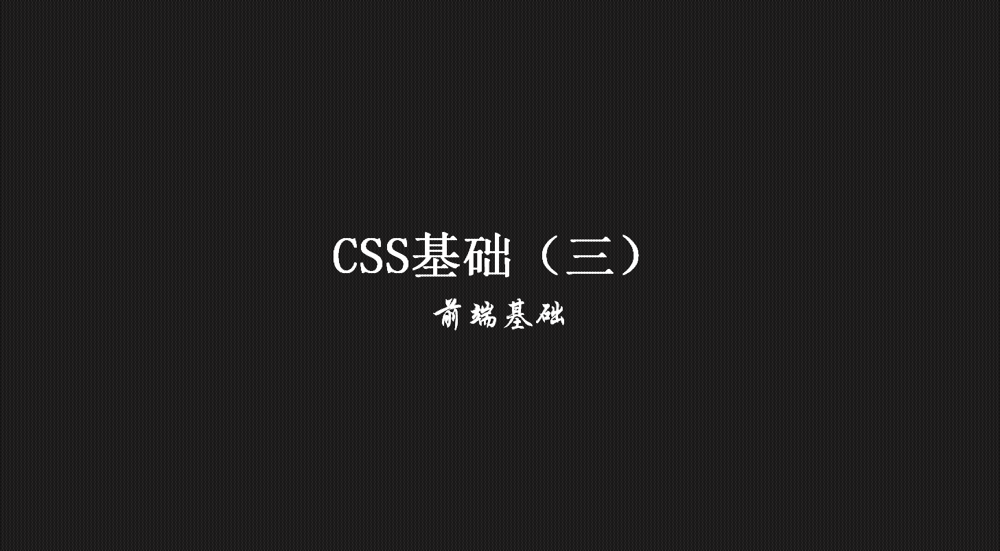

> **一番码客：挖掘你关心的亮点。**
> **http://www.efonmark.com**

本文目录：

[TOC]



<!--more-->

## 标签选择器


```html
<!DOCTYPE html>
<html>
	<head>
		<meta charset="UTF-8">
		<title>一番码客</title>
		<style>
			p{
				color: red;
			}
			h1{
				color: green;
			}
		</style>
	</head>
	
	<body>
		<p>一番码客</p>
		<p>一番码客</p>
		<h1>一番码客</h1>
	</body>
</html>
```

* 使用方法：标签名{定义样式}。
* 生效范围：当前页面所有使用到该标签的内容。

## 类选择器


```html
<!DOCTYPE html>
<html>
	<head>
		<meta charset="UTF-8">
		<title>一番码客</title>
		<style>
			p.class1{
				color: red;
			}
			h1.class1{
				color: green;
			}
		</style>
	</head>
	
	<body>
		<p class="class1">一番码客</p>
		<p>一番码客</p>
		<h1 class="class1">一番码客</h1>
	</body>
</html>
```

* 类选择器区分大小写。
* 使用方法：
    * 在开始标签中定义一个属性 `class=类名`。
    * 在style定义选择器`.类名{定义属性}`。
* 生效范围：
    * 当前页面所有使用到类的内容。
    * 如果有多个标签定义了同一个类，可以使用`标签.类名`的方式分别定义样式。

## ID选择器


```html
<!DOCTYPE html>
<html>
	<head>
		<meta charset="UTF-8">
		<title>一番码客</title>
		<style>
			#id1{
				color: red;
			}
			#id2{
				color: green;
			}
		</style>
	</head>
	
	<body>
		<p id="id1">一番码客</p>
		<p>一番码客</p>
		<h1 id="id2">一番码客</h1>
	</body>
</html>
```

* ID选择器区分大小写。
* 在同一个页面，一个ID只能出现一次。
* 使用方法：
    * 在开始标签中定义一个属性 `id=类名`。
    * 在style定义选择器`#id{定义属性}`。
* 生效范围：
    * 当前页面定义了该ID的内容。

## 群组选择器


```html
<!DOCTYPE html>
<html>
	<head>
		<meta charset="UTF-8">
		<title>一番码客</title>
		<style>
			.class1,h1{
				color: red;
			}
			.class1{
				font-size: 30px;
			}

		</style>
	</head>
	
	<body>
		<p class="class1">一番码客</p>
		<p>一番码客</p>
		<h1>一番码客</h1>
	</body>
</html>
```

* 使用方法：`选择器,选择器{定义属性}`。
* 作用：抽取共同的属性。

## 全局选择器


```html
<!DOCTYPE html>
<html>
	<head>
		<meta charset="UTF-8">
		<title>一番码客</title>
		<style>
			* {
				padding: 0;
				margin: 0;
				color: green;
			}
		</style>
	</head>
	
	<body>
		<p>一番码客</p>
		<p>一番码客</p>
		<h1>一番码客</h1>
	</body>
</html>
```

* 使用方法：`* {}`。
* `*`通配符，代表所有。

## 参考

* 黑马程序员 120天全栈区块链开发 开源教程

  > https://github.com/itheima1/BlockChain
  

----

> **一番雾语：CSS选择器。**

----------

> **免费知识星球： [一番码客-积累交流](http://www.efonmark.com/efonmark-blog/readme/zhishixingqiu1.png)**
> **微信公众号：[一番码客](http://www.efonmark.com/efonmark-blog/readme/guanzhu_1.jpg)**
> **微信：[Efon-fighting](http://www.efonmark.com/efonmark-blog/readme/weixin.jpg)**
> **网站： [http://www.efonmark.com](http://www.efonmark.com)**