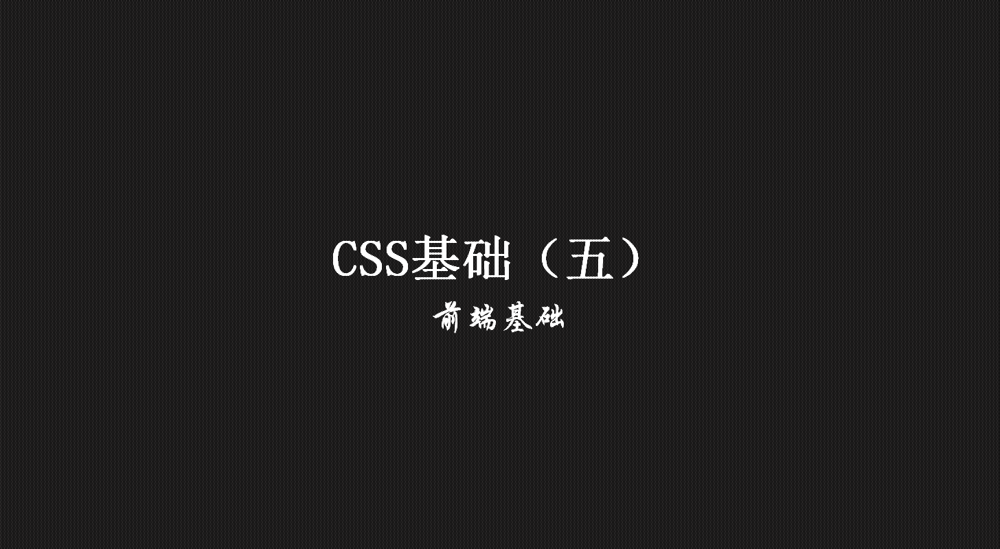

> **一番码客：挖掘你关心的亮点。**
> **http://www.efonmark.com**

本文目录：

[TOC]



<!--more-->

## 继承


```html
<!DOCTYPE html>
<html>
	<head>
		<meta charset="UTF-8">
		<title>继承</title>
		<style>
			div{
				color: red;
				border: #0000ff 1px solid;
			}
			
			p{
				border: #0000ff 1px solid;
			}
		</style>
	</head>
	<body>
		asdfafd   asdffd
		<div>
			asdfadf asdfasdf
			<span>asdfasdf</span>
			<span>asdfasdf</span>
			<p>这是一个p标签</p>
		</div>
		asdfa asdffadf

	</body>
</html>
```

* 父元素定义了样式，子元素也使用了对应的样式，这叫做继承。
* 并不是所有样式都可以被继承，例如`border`属性。
* 页面的布局都是CSS+DIV实现的。
    * p标签前后的内容会换行。
    * div标签前后的内容会换行；是一个容器，不会改变里面内容的样式；可以放入任何的标签/ 的内容。
    * span标签也是容器，一般放入的内容：文本/ a标签，前后的内容不会换行。

## 层叠


```html
<!DOCTYPE html>
<html>
	<head>
		<meta charset="UTF-8">
		<title></title>
		<style>
			p{
				color: blue;
				font-size: 50px;
			}
		</style>
	</head>
	<body>
		<p style="color: red;">这是一个段落</p>
	</body>
</html>
```

* 对同一个内容指定了多种样式，如果样式是不一样的，就叠加生效；如果样式是一样的，就按照就近原则。

## 命名规范

* 采用英文字母，数字，中划线，下划线命名，但不建议使用下划线；
* 以英文字母开头，不能以数字、中划线、下划线开头；
* 一个单词时，全部使用小写；
* 多个单词时，可以使用驼峰命名，或使用中划线、下划线分割单词；
* 命名时，尽量有意义；
* 不要随意使用id；
* 不要随意使用缩写，除非时常用的。

## 参考

* 黑马程序员 120天全栈区块链开发 开源教程

  > https://github.com/itheima1/BlockChain
  

----

> **一番雾语：CSS继承、层叠与命名规范。**

----------

> **免费知识星球： [一番码客-积累交流](http://www.efonmark.com/efonmark-blog/readme/zhishixingqiu1.png)**
> **微信公众号：[一番码客](http://www.efonmark.com/efonmark-blog/readme/guanzhu_1.jpg)**
> **微信：[Efon-fighting](http://www.efonmark.com/efonmark-blog/readme/weixin.jpg)**
> **网站： [http://www.efonmark.com](http://www.efonmark.com)**