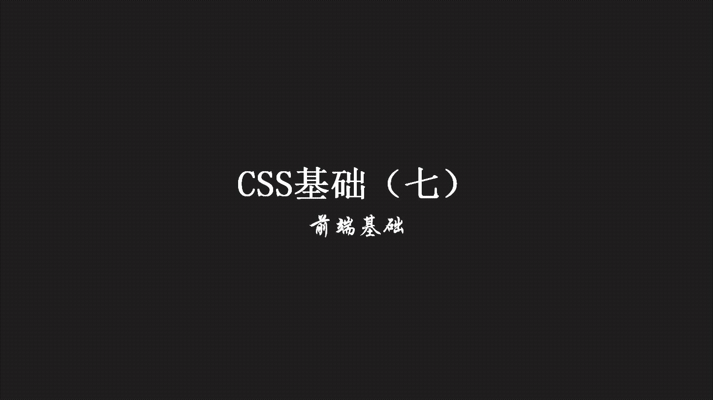
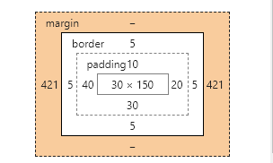

> **一番码客：挖掘你关心的亮点。**
> **http://efonfighting.imwork.net**

本文目录：

[TOC]



<!--more-->

## 盒子模型



```html
<!DOCTYPE html>
<html>
	<head>
		<meta charset="UTF-8">
		<title></title>
		<style type="text/css">
			.div1{
				width: 100px;
				height: 200px;
				border: 5px solid red;
				padding: 10px 20px 30px 40px;
				margin: 0 auto;
				box-sizing: border-box; /*不更改盒子的大小*/
			}
		</style>
	</head>
	<body>
		<div class="div1"></div>
	</body>
</html>

```

* 外边距不会改变盒子的大小，盒子大小：
    * 宽 = width + border左右的宽度 + padding左右的宽度。
    * 高 = height + border上下的宽度 + padding上下的宽度。

* padding
    * `padding：10px`；上下左右都是10px。
    * `padding：10px 20px`；上下10px，左右20px。
    * `padding：10px 20px 30px`；上10px，左右20px，下30px。
    * `padding：10px 20px 30px 40px`；上右下左顺时针指定值。
* `margin`：`0 auto`；设置水平居中。
* 可定义宽高的元素：
    * 块级元素（独占一行）：`p`、`div`、`h1-h6`、`ul`、`li`、`ol`、`dl`、`dt`、`dd`。
    * 替换元素：`img`、`input`、`textarea`。
* marging可以指定负值。
* 默认情况下，块级元素时有margin的，因此可以自己声明样式覆盖默认样式。
* margin设置为auto时，元素会有水平居中。
* 外边距合并：垂直方向的外边距相遇时会合并成一个外边距，这个外边距的高度等于较大的那个外边距。

## 参考

* 黑马程序员 120天全栈区块链开发 开源教程

  > https://github.com/itheima1/BlockChain
  

----

> **一番雾语：CSS盒子模型。**

----------

> **免费知识星球： [一番码客-积累交流](http://efonfighting.imwork.net/efonmark-blog/%E7%AE%80%E4%BB%8B/zhishixingqiu1.png)**
> **微信公众号：[一番码客](http://efonfighting.imwork.net/efonmark-blog/%E7%AE%80%E4%BB%8B/guanzhu_1.jpg)**
> **微信：[Efon-fighting](http://efonfighting.imwork.net/efonmark-blog/%E7%AE%80%E4%BB%8B/weixin.jpg)**
> **网站： [http://efonfighting.imwork.net](http://efonfighting.imwork.net)**