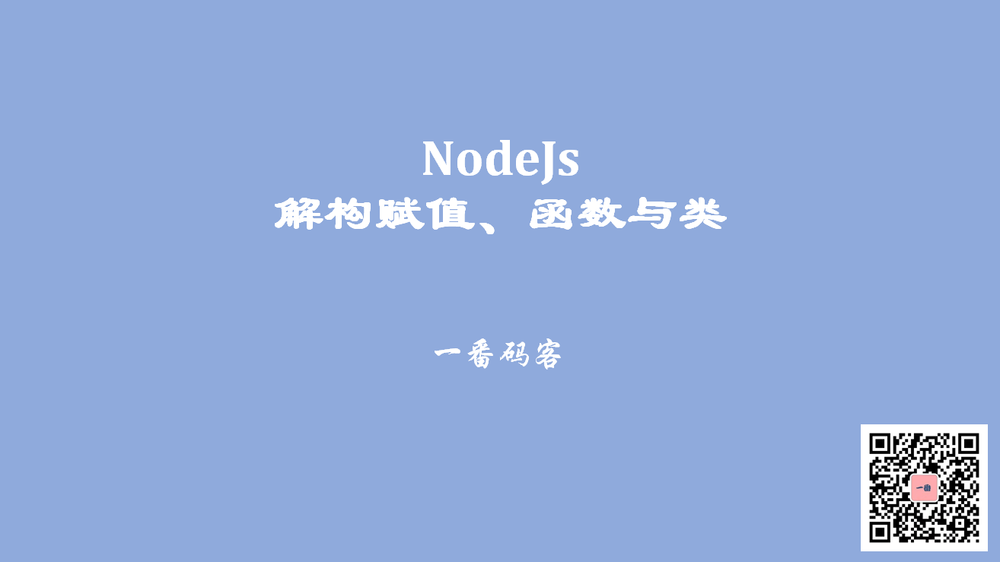

> **一番码客 : 挖掘你关心的亮点。**
> **http://www.efonmark.com**

本文目录：

[TOC]



<!--more-->


## 解构赋值

> ES6 允许我们按照一定模式，从数组和对象中提取值，对变量进行赋值，这被称为解构（Destructuring）

- 数组的解构赋值

    ```javascript
    const arr = [1, 2, 3] //我们得到了一个数组
    let [a, b, c] = arr //可以这样同时定义变量和赋值
    console.log(a, b, c); // 1 2 3	
    ```

- 对象的解构赋值（常用）

    ```javascript
    const obj = { name: '一番',address:'成都', age: '100'} //我们得到了一个对象
    let {name, age} = obj //可以这样定义变量并赋值
    console.log(name, age); //一番 100
    ```

- 函数参数的解构赋值（常用）

    ```javascript
    const person = { name: '一番', age: 11}
    function printPerson({name, age}) { // 函数参数可以解构一个对象
        console.log(`姓名：${name} 年龄：${age}`);
    }
    printPerson(person) // 姓名：一番 年龄：11
    ```

    

## 函数扩展

> ES6 对函数增加了很多实用的扩展功能。

- 参数默认值，从ES6开始，我们可以为一个函数的参数设置默认值

    ```javascript
    function foo(name, address = '成都') {
        console.log(name, address);
    }
    foo("一番") // address将使用默认值
    foo("小王", '上海') // address被赋值为'上海'
    ```

- 箭头函数，将`function`换成`=>`定义的函数，就是箭头函数

    ```javascript
    function add(x, y) {
        return x + y
    }
    // 这个箭头函数等同于上面的add函数
    (x, y) => x +y;
    // 如果函数体有多行，则需要用大括号包裹
    (x, y) => {
        if(x >0){
            return x + y
        }else {
            return x - y
        }
    }
    ```


## Class继承

>由于js一开始被设计为函数式语言，万物皆函数。所有对象都是从函数原型继承而来，通过继承某个函数的原型来实现对象的继承。但是这种写法会让新学者产生疑惑，并且和传统的OOP语言差别很大。ES6 封装了class语法来大大简化了对象的继承。

```javascript
class Person {
    constructor(name, age){
        this.name = name
        this.age = age
    }
    // 注意：没有function关键字
    sayHello(){
        console.log(`大家好，我叫${this.name}`);
    }
}
class Man extends Person{
    constructor(name, age){
        super(name, age)
    }
    //重写父类的方法
    sayHello(){
        console.log('我重写了父类的方法！');
    }
}
let p = new Person("一番", 33) //创建对象
p.sayHello() // 调用对象p的方法，打印 大家好，我叫一番
let m = new Man("小五", 33)
m.sayHello() // 我重写了父类的方法！
```


> 一番雾语：什么是奋斗？奋斗就ܼ是每一天很难，可一年一年却越来越容易。不奋斗就ܼ是每݁天都很容易，可一️年一年越来越难。

-------
<table>
<tr>
<td ><center></center></td>
<td width="50%" align=left><b>
    免费知识星球：<a href="http://efonfighting.imwork.net/efonmark-blog/%E7%AE%80%E4%BB%8B/zhishixingqiu1.png">一番码客-积累交流</a><br>
    微信公众号：<a href="http://efonfighting.imwork.net/efonmark-blog/%E7%AE%80%E4%BB%8B/guanzhu_1.jpg">一番码客</a><br>
    微信：<a href="http://efonfighting.imwork.net/efonmark-blog/%E7%AE%80%E4%BB%8B/weixin.jpg">Efon-fighting</a><br>
    网站：<a href="http://efonfighting.imwork.net">http://efonfighting.imwork.net</a><br></b></td>
</tr>
</table>