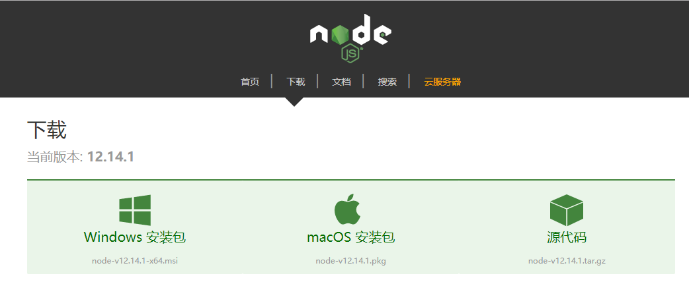

> **一番码客 : 挖掘你关心的亮点。**
> **http://www.efonmark.com**

本文目录：

[TOC]


<!--more-->

## 前言

在浏览器端写JS，其实就是使用浏览器给我们提供的功能和方法来写代码。

在Node端写JS，就是用Node封装好的一系列功能模块来写代码。

NodeJS封装了网络，文件，安全加密，压缩等等很多功能模块，我们只需要学会常用的一些，然后在需要的时候去查询文档即可。

## NodeJs下载与安装

下载地址：<http://nodejs.cn/download/>



安装完毕，在命令行输入：`node -v`查看node的版本，如果能成功输出，证明安装没有问题。

## npm介绍

npm是Nodejs自带的包管理器，当你安装Node的时候就自动安装了npm。

通俗的讲，当我们想使用一个功能的时候，而Node本身没有提供，那么我们就可以从npm上去搜索并下载这个模块。

每个开发语言都有自己的包管理器，比如，java有maven，python有pip。

而npm是目前世界上生态最丰富，可用模块最多的一个社区，没有之一。基本上，你所能想到的功能都不用自己手写了，它已经在npm上等着你下载使用了。

npm的海量模块，使得我们开发复杂的NodeJs的程序变得更为简单。


## 使用npm

- 查找想要安装的包：

    - npm官网(https://www.npmjs.com/)。

- 手动生成`package.json`：

    ```json
    {
      "name": "Node01",
      "version": "0.0.1",
      "dependencies": {
        "fs-extra": "^8.1.0"
      }
    }
    ```

- 用npm安装包，并保存到`package.json`文件中：

    - `npm install fs-extra`，会自动更新安装的包名到`package.json`的`dependencies`字段里。

* 根据`package.json`安装依赖包：
    * `npm install`，会根据`package.json`安装所有依赖包，便于工程迁移。

## 参考

* 黑马程序员 120天全栈区块链开发 开源教程

    > https://github.com/itheima1/BlockChain


> 一番雾语：是时候学学新的js语法了。

-------
<table>
<tr>
<td ><center></center></td>
<td width="50%" align=left><b>
    免费知识星球：<a href="http://www.efonmark.com/efonmark-blog/readme/zhishixingqiu1.png">一番码客-积累交流</a><br>
    微信公众号：<a href="http://www.efonmark.com/efonmark-blog/readme/guanzhu_1.jpg">一番码客</a><br>
    微信：<a href="http://www.efonmark.com/efonmark-blog/readme/weixin.jpg">Efon-fighting</a><br>
    网站：<a href="http://www.efonmark.com">http://www.efonmark.com</a><br></b></td>
</tr>
</table>