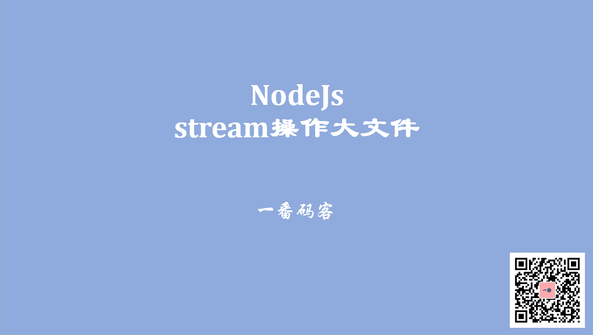

> **一番码客 : 挖掘你关心的亮点。**
> **http://www.efonmark.com**

本文目录：

[TOC]



<!--more-->

## stream（流）

`fs.readFile`在读取小文件时很方便，因为它是一次把文件全部读取到内存中；

假如我们要读取一个3G大小的电影文件，那么内存不就爆了么？node提供了流对象来读取大文件。

流的方式其实就是把所有的数据分成一个个的小数据块（chunk），一次读取一个chunk，分很多次就能读取特别大的文件，写入也是同理。

这种读取方式就像水龙头里的水流一样，一点一点的流出来，而不是一下子涌出来，所以称为流。

## 常用的API

- `fs.createReadStream/fs.createWriteStream`
- `reader.pipe(writer)`


## 代码示例

```js
'use strict'
let fs = require("fs");

fs.readFile("MobyLinuxVM.vhdx", (err, data)=>{
    console.log(err);
});

let reader = fs.createReadStream("MobyLinuxVM.vhdx");
let writer = fs.createWriteStream("MobyLinuxVM-copy.vhdx");
let len = 0;
reader.on('data', (chunk)=>{
    //chunk是每次读取到的一小块字节
    console.log(chunk.length);
    len += chunk.length;
    writer.write(chunk, ()=>{
        console.log("写入了一个chunk");
    })
});
reader.on('end', ()=>{
   console.log("读取完毕,总大小："+len);
});

reader.pipe(writer);
```

## 参考

* 黑马程序员 120天全栈区块链开发 开源教程

    > https://github.com/itheima1/BlockChain

## 学习视频
一番同步了对应的学习视频到B站，长按识别可访问一番B站主页观看。


> 一番雾语：nodejs操作本地大文件的方法。

-------
<table>
<tr>
<td ><center></center></td>
<td width="50%" align=left><b>
    免费知识星球：<a href="http://www.efonmark.com/efonmark-blog/readme/zhishixingqiu1.png">一番码客-积累交流</a><br>
    微信公众号：<a href="http://www.efonmark.com/efonmark-blog/readme/guanzhu_1.jpg">一番码客</a><br>
    微信：<a href="http://www.efonmark.com/efonmark-blog/readme/weixin.jpg">Efon-fighting</a><br>
    网站：<a href="http://www.efonmark.com">http://www.efonmark.com</a><br></b></td>
</tr>
</table>