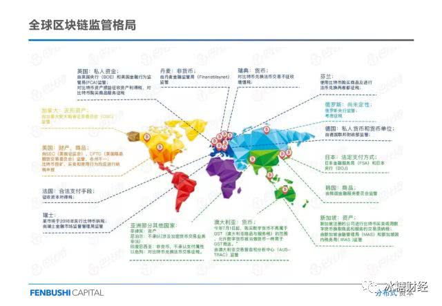
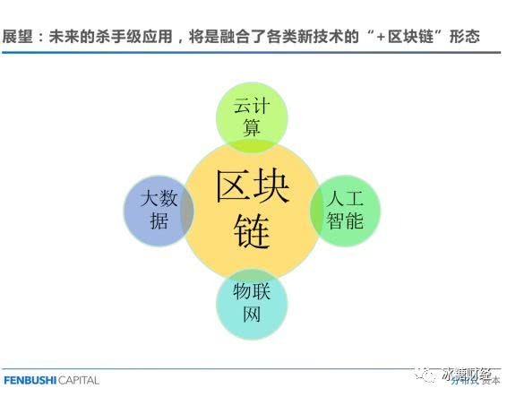

> **一番码客 : 挖掘你关心的亮点。**
> **http://efonfighting.imwork.net**

本文目录：

[TOC]

> 原文：对话余文波：区块链的十大前景应用“冰糖独家”
>
> 链接： https://new.qq.com/omn/20180209/20180209G1DZYL.html 

## 1. 区块链到底是什么呢？

字面上看高深莫测，难以在脑海中描绘具体画面。

我们可以不明白它高深的技术细节，但要了解其原理，才能懂得其价值。

区块链本质上是一种新型记账技术，是一种去信任中介的分布式记账技术。

这么一说，脑海里会浮现了一副画面，一个账房先生戴着近视眼镜把弄着算盘，记账。

现代经济生活中处处充斥着中心化的记账机构，很多经济活动也离不开它。

例如银行，它可能拥有一个庞大到你看不见的数据库，但它的运转依旧是一个记账的行为。

去银行存钱，严格来说我们是债权人，银行是债务人，当我们将钱存入银行，帐竟然是由债务人来记，更奇特的是，我们还很相信它。

如今购买股票也只用在手机上轻松一点便能实现，但是我们看不见的背后却充斥着庞大的中心化机构在完成后续的流程。

记账是所有经济活动基础的一个工具，一项功能。

在区块链技术之前，记账靠银行、中证登、中债登、房地产交易中心等中介机构。中心化的机构使得经济活动得以开展，可这些方式也滋生了许多问题。

### 1.1 第一个问题：成本增加、效率降低

庞大的金融、中介机构，会大量消耗资源，需要人力和硬件支持。

### 1.2 第二个问题：中心化机构通常比较脆弱

银行为了防范风险，会在多处设置资源备份，可是有限的数据库也极易遭到攻击，与此同时维护也将消耗大量的人力物力。

区块链技术不仅保留了记账技术，还摆脱了所谓的中心化信任机构的限制。

分布式模式下所有参与这个系统的个体或节点，共同维护一个账本，完美地解决了过去中心化记账机构所存在的弊端。

### 1.3 小结

区块链是一种以密码学方式保证的、不可篡改和不可伪造的分布式账本技术。

以严谨的数学解决方案构建起了与“中心化”机制相媲美的“去中心化”信任机制（并非有了区块链，就可以省去信任，区块链以非中心化的方式构建信任机制）。

区块链技术将重构人类经济活动的基础架构，催生出全新的分布式商业形态。

强势安利中本聪的论文，如何进行分布、如何保证数据不被篡改，文中都能给你答案。

## 2. 区块链技术的独有优势

所有的中心化系统都是可改的。

在区块链技术产生之前，人类社会从未实现过，人造系统数据自己无法更改。

比如说银行的数据库，支付宝的余额，所有的中心化系统一定有一个超级管理员。

区块链是一种记账技术；这种记账技术有两个最大的特点：记客观事实，记载之后谁也无法篡改。

在这个理论基础上，出现了很多颠覆性的商业模式。

## 3. 避免两个认知极端

### 3.1 把区块链当神话，觉得它能颠覆一切

其实区块链只能完成具有上述两个特点的事情。

### 3.2 认定区块链是传销、庞氏骗局

这是两个认知误区，对于区块链而言，如何去利用，最为重要。

## 4. 区块链的应用领域

区块链可不止比特币这一个应用，即使这个技术年轻，但很多领域已经开始尝试，且表现不俗，转角遇到区块链也是指日可待。

### 4.1 支付

最初涉足的是金融领域，比特币就具有金融特性。

跨国支付，目前效率有限，耗时长且成本极高。通过区块链技术，在APP上进行跨境即时转账，构建虚拟货币和传统货币兑换体系，能极大降低人力和时间成本。

特别在欠发达国家，互联网覆盖范围远远高于金融体系，这些地区的居民就能利用互联网或者虚拟货币转账平台享受高效的金融服务。

区块链能创造全新的商业模式，且不依赖于现有基础设施。

### 4.2 清算与结算

传统的清算结算系统中，在手机端进行的操作，并没有完成资金转移，仅被看作用户给银行下达的一个指令，最终依旧需要依赖银行对双方账户进行数字修改。如若跨行，则需更为庞大的系统支持。

区块链的世界里，它是一个分布式的点对点的支付系统，支付即结算。

没有中介机构记账，省略系统，节省大量资源。

### 4.3 保险

早期不存在巨型商业化的保险公司，只有小范围内自发的团体互助保险模式。

区块链2.0，智能合约成为构筑互助保险的契机。

农业方面极为适合，当我们基于天气系统，共同构筑一个自动执行的智能合约机制之后，如若自然灾害发生，事实能够被轻易验证，保险即能在区块链基础上自动执行、完成理赔。

### 4.4 供应链管理

苹果公司的核心竞争力在于供应链管理能力，苹果产品的零件来源于世界各地，只有好的供应链管理模式，才能保证产品的时效和品质。

独立商业主体在行业这根链条上，每个主体等同于独立的数据库，但频繁的商业合作网络，导致数据库必须频繁地交互往来，这就容易导致两个问题：

1. 在交互中，某个环节出现问题，追责极为困难，例如食品运输；

2. 由于各自数据库结构不同，产品在供应链上位置难以追踪。

区块链技术下，各个环节并入同一个系统，各个独立数据库变成一个统一的整体，查询追责变得极其清晰。

### 4.5 媒体、知识产权、IP

利用上传数据后可追溯且不可更改的特性，区块链技术将有助于知识产权保护。

### 4.6 产品防伪、溯源同理

奢侈品打假是该应用的一个重要领域。每年LV耗费5%的收益打假，但效益有限。

曾经的中心化打假模式，防伪系统极其脆弱；在区块链平台上，造假成本将变得极高。

食品行业也是如此，区块链、物联网的结合，使消费者能获得农产品的源头信息，食品数据可追溯性大大提高。

### 4.7 医疗

大数据时代数据安全显得尤为重要。

我们的数据存在不同的医院，但是当患者选择其他医院看病之时，数据无法被提取及共享。

消费数据在淘宝，医疗数据在医院，可我们不曾拥有。

区块链技术能构建个人的医疗数据体系，数据的所有权真正掌握在所有者手中，并通过私钥控制。

我们也不必担心数据私有后影响AI等发展，在良好的激励机制下，数据依旧可以被主动且高效的自愿共享。

### 4.8 身份验证

某些场合提供身份证明时，现有体系流程复杂、所需资料繁多，例如证明“我”就是“我”本人的无厘头事件。

区块链构造全社会的身份体系，只要保证录入时的真实性，则不会被篡改，省略了繁杂的资料和流程，日后的身份证明仅出示私钥便能达成。

### 4.9 政务管理

区块链技术有利于构建统一的数据系统，例如房产业、资产管理、过户等。

极大提高政府公共事务管理的便捷性。

美国总统选举系统，传统而陈旧，统计中容易出现偏差。目前有人开发全国区块链投票系统，与唯一ID对接，大大提高政府工作效率。

### 4.10 新技术： AI，云计算

物联网的运用，目前还不具备实施的条件，一是硬件设施还未到位；二是人们对自动的物与物之间数据交换的安全性存疑 。

好比我买了个捶背的机器人，可有人恶意篡改数据设置，将捶背的操作变成掐脖子，那可是完蛋了。

数据安全是最基础的要求，在数学层面被证明不容易被篡改，才能真正得以利用。

## 5. 目前投资区块链恰逢其时

## 6. 区块链技术的全球热度

## 7. 监管

发达国家对ICO较为友好，比如美国、日本、新加坡等

发展中国家两极分化：有的渴望弯道超车，无条件拥抱；另一些国家对某些领域理智地禁止

## 8. 展望

----

> **一番雾语：**保持宁静的心态，澎湃的斗志。

----------

> **免费知识星球： [一番码客-积累交流](http://efonfighting.imwork.net/efonmark-blog/%E7%AE%80%E4%BB%8B/zhishixingqiu1.png)**
> **微信公众号：[一番码客](http://efonfighting.imwork.net/efonmark-blog/%E7%AE%80%E4%BB%8B/guanzhu_1.jpg)**
> **微信：[Efon-fighting](http://efonfighting.imwork.net/efonmark-blog/%E7%AE%80%E4%BB%8B/weixin.jpg)**
> **网站： [http://efonfighting.imwork.net](http://efonfighting.imwork.net)**